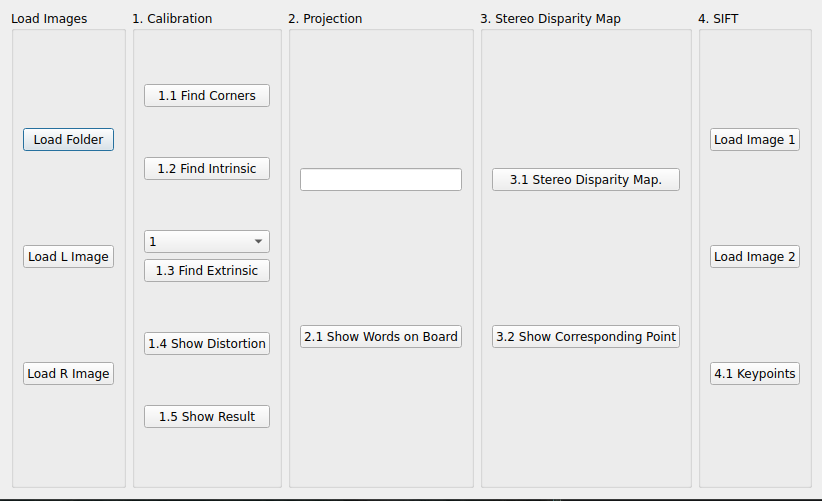
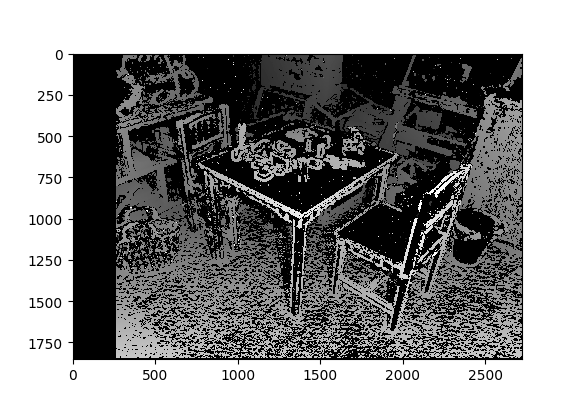
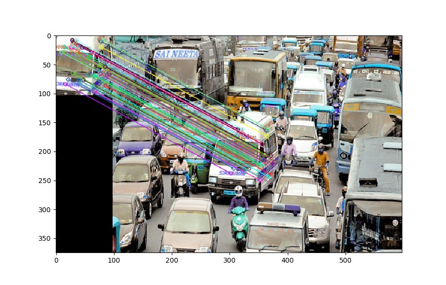
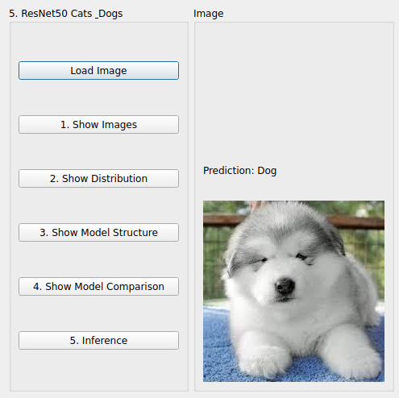

# Computer Vision and Deep Learning
This repo is for the compouter vision and deep learning course at NCKU, 2022 fall semester.
The assigments in this repo all involve designing a GUI using PyQT to display the solutions.

Assignments for this course include:

1. **Homework 1**: This homework focuses mostly on camera callibration.
Users are presented with an interface like this:

which can perform these various functions on a directory filled with images or a single pair of images.
For instance, the stereo disparity map between two images looks like the following:

2. **Homework 1 pt.2**: For this assignment we match features via the SIFT algorithm.
The matched features look like this:

3. **Homework 2**: In this assignment we perform background removal on a video, and also perform flow detection in
a video by first capturing interesting keypoints.

- Background removal 

- Optical Flow

4. **Homework 2.5**: The final assignment required training a ResNet CNN on the cats and dogs dataset,
then presenting the results in a gui like the following:

